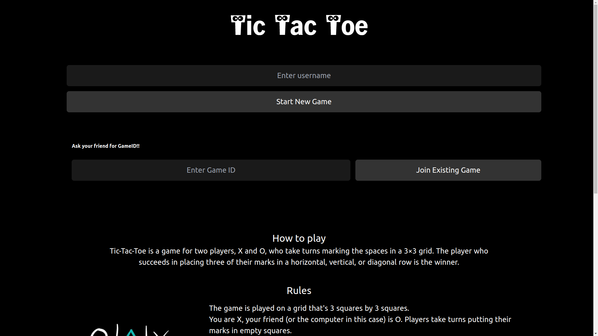
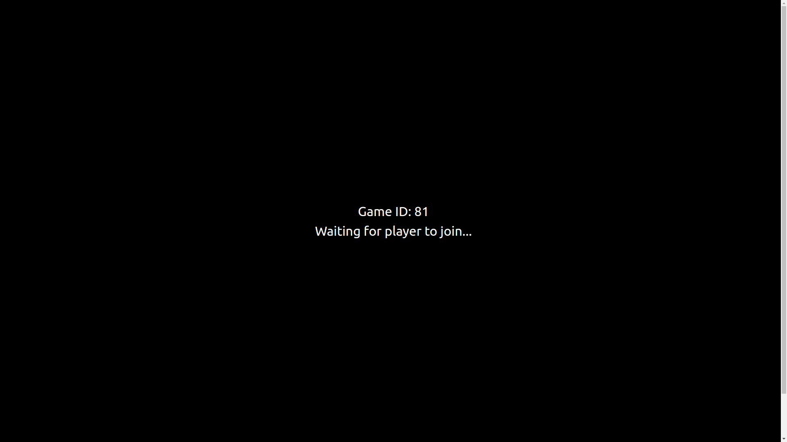
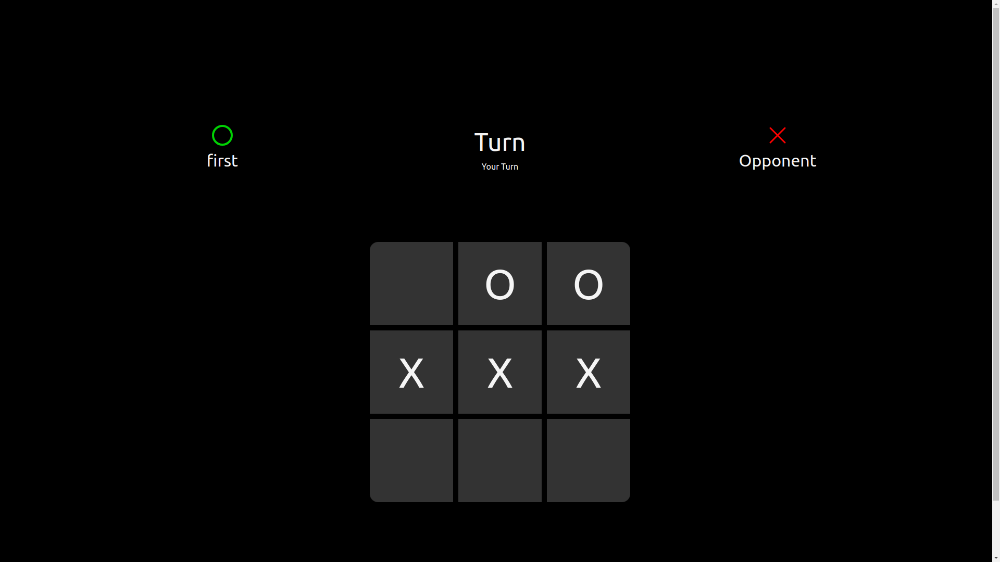

# Tic Tac Toe Multiplayer (Next.js & Django)
Ready for some tic tac toe battles? Challenge your friends or strangers worldwide in this exciting web application built with Next.js and Django REST Framework. Enjoy a smooth, responsive user interface, robust backend logic, and real-time gameplay thanks to WebSocket integration.

## Features

- **Multiplayer**: Clash with friends or random opponents in thrilling real-time matches.
- **Responsive UI**: Smooth and user-friendly experience on any device.
- **API-Driven**: Leverages Django REST Framework for efficient backend communication.
- **Scalable & Robust**: Designed to handle growing players and intense gameplay.

## Getting Started
### Prerequisites
- [Node.js](https://nodejs.org/)
- [npm](https://www.npmjs.com/)
- [Python](https://www.python.org/)
- [Django](https://www.djangoproject.com/)
- [Django REST Framework](https://www.django-rest-framework.org/)

### Installation
1. Clone the repository:
   ```sh
   git clone "https://github.com/DeepakSilaych/TicTacToe"
    ```
  
2. Navigate to the project directory:
    ```sh
    cd TicTacToe
    ```
3. for backend:
    ```sh
    cd backend
    ```
    ```sh
    pip install -r requirements.txt
    ```
    ```sh
    python manage.py runserver
    ```
4. for frontend:
    ```sh
    cd frontend
    ```
    ```sh
    npm install
    ```
    ```sh

    npm run dev
    ``` 

5. Open your browser and go to `http://localhost:3000/` to see the application running.

## Screenshots




## License
Distributed under the MIT License. See `LICENSE` for more information.